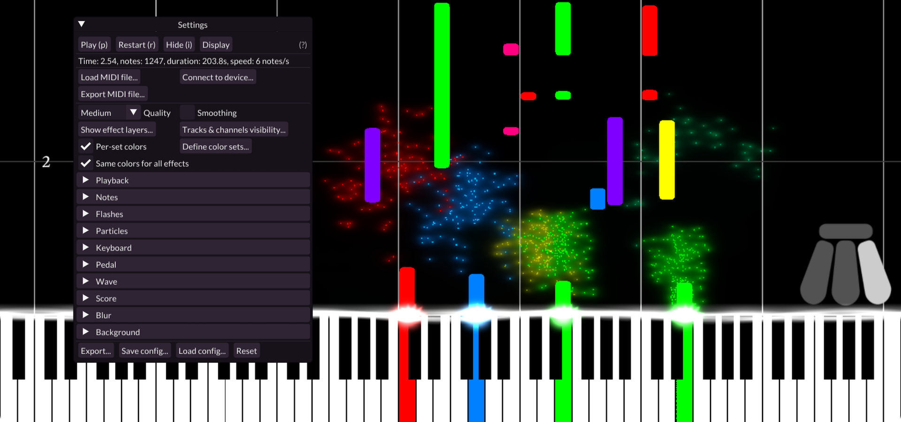

# MIDI Visualizer

A MIDI file visualizer built with C++/OpenGL. Drop in a MIDI file and watch the notes scroll down with particle effects and keyboard animation. No audio playback, visuals only.



## Build

You need CMake 3.8+, a C++11 compiler, and OpenGL 3.2+. FFmpeg is optional and enables video export.

```bash
mkdir build && cmake -S . -B build && cmake --build build
```

The app will be at `build/MIDIVisualizer.app` (macOS) or `build/MIDIVisualizer` (Linux/Windows).

**Linux only** -> install these first:
```
xorg-dev libgtk-3-dev libnotify libasound2-dev
```
For video export add: `libavcodec-dev libavformat-dev libavdevice-dev`

## Run

On macOS, just double-click the app or run it from the terminal:

```bash
open build/MIDIVisualizer.app
```

A file picker opens on startup. Pick a `.mid` file and you're good to go.

You can also pass a file directly:

```bash
./MIDIVisualizer --midi path/to/file.mid
```

## Keyboard shortcuts

- `p` -> play / pause
- `r` -> restart from beginning
- `i` -> show / hide settings panel

## CLI options

```
--midi <path>        MIDI file to load
--device <name>      Live MIDI input device (use VIRTUAL for a virtual device)
--config <path>      Load settings from an INI file
--size <W> <H>       Window size
--fullscreen <0|1>   Start fullscreen
--quality <level>    LOW_RES / LOW / MEDIUM / HIGH / HIGH_RES
--help               Show all available options
```

**Export options:**

```
--export <path>      Output path for video or PNG frames
--format <fmt>       PNG / MPEG2 / MPEG4 / PRORES
--framerate <n>      Frames per second
--hide-window <0|1>  Run headless during export
```

Example -> export a 1080p video without showing the window:

```bash
./MIDIVisualizer --midi song.mid --size 1920 1080 --export out.mp4 --format MPEG4 --hide-window 1
```
