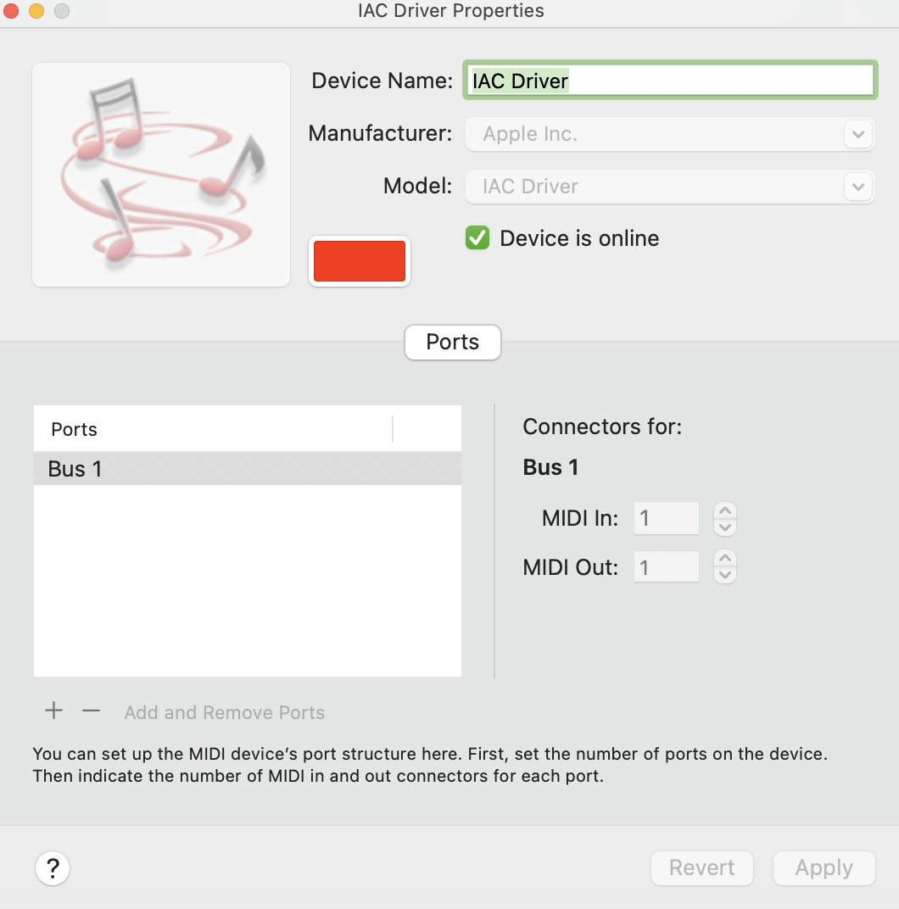
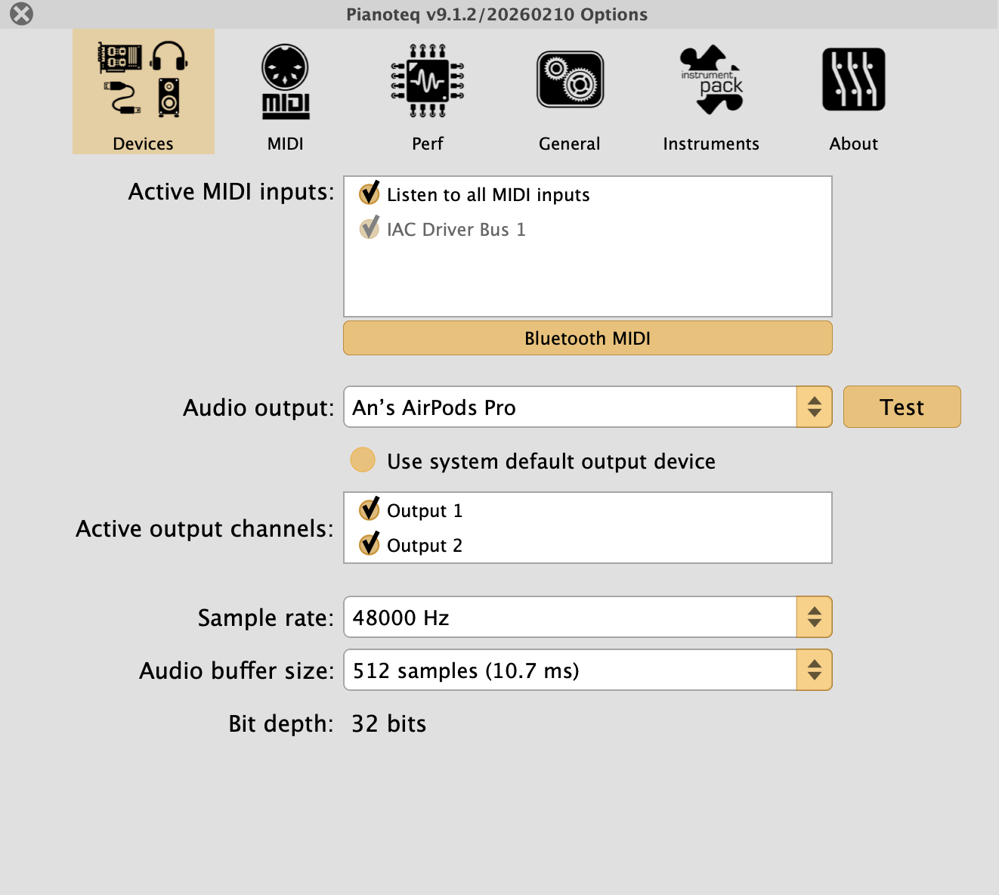
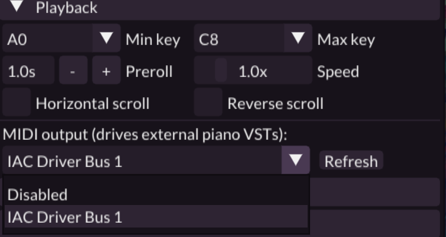

# MIDI Visualizer

<p align="center">
  
</p>

A little MIDI visualizer for piano lovers. Feed it a `.mid` file and it draws the notes falling onto a keyboard, with particles and pretty lights. Think Synthesia, but open source and a lot more customizable.

> No built-in sound. The app can stream MIDI to any piano VST (Pianoteq, Garritan, Keyscape, etc.) over a virtual MIDI port. Setup below.

## Build it

You'll need:
- CMake 3.8+
- A C++11 compiler (clang on macOS, gcc on Linux, MSVC on Windows)
- OpenGL 3.2+
- FFmpeg (optional, only if you want video export)

Then just:

```bash
mkdir build && cmake -S . -B build && cmake --build build
```

You'll get `build/MIDIVisualizer.app` on macOS, or `build/MIDIVisualizer` on Linux/Windows.

**On Linux**, install these first:
```
xorg-dev libgtk-3-dev libnotify libasound2-dev
```
And for video export: `libavcodec-dev libavformat-dev libavdevice-dev`

## Run it

Easiest way on macOS:

```bash
open build/MIDIVisualizer.app
```

A file picker pops up -> grab any `.mid` file. Try one of your favorite pieces. Personally I like dropping in some Ghibli soundtracks (Howl's Moving Castle, Spirited Away) and watching them play out.

Want to skip the file picker? Pass it directly:

```bash
./MIDIVisualizer --midi path/to/song.mid
```

## Controls

- `p` -> play / pause
- `r` -> restart
- `i` -> toggle the settings panel

Inside the settings panel you can mess with colors, particles, the background, keyboard style, basically everything you see on screen.

## Synced audio (Pianoteq or any piano VST)

Run a sound engine (Pianoteq 9 used as the example, anything that takes MIDI input works) alongside the visualizer and route notes to it through a virtual MIDI cable. One-time setup, then it's automatic.

### macOS

**1.** Open `Audio MIDI Setup` -> `Window` -> `Show MIDI Studio` -> double-click **IAC Driver** -> tick **"Device is online"**.



**2.** In Pianoteq -> `Options` -> `Devices` -> **MIDI Input** -> enable `IAC Driver Bus 1`.



**3.** In MIDIVisualizer -> press `i` -> expand **Playback** -> pick `IAC Driver Bus 1` from the **MIDI output** dropdown.



### Windows

Windows has no built-in virtual MIDI port, so install **loopMIDI** (free, by Tobias Erichsen) once.

1. Install [loopMIDI](https://www.tobias-erichsen.de/software/loopmidi.html), open it, click `+` to create a port named `loopMIDI Port`.
2. In Pianoteq -> `Options` -> `Devices` -> **MIDI Input** -> enable `loopMIDI Port`.
3. In MIDIVisualizer -> press `i` -> expand **Playback** -> pick `loopMIDI Port` from the **MIDI output** dropdown.

After that: just open Pianoteq (it can be minimized), load your `.mid` in MIDIVisualizer, press `p`. Visuals + audio in sync, one play button.

## CLI flags

The basics:

```
--midi <path>        MIDI file to load
--device <name>      Live MIDI input (use VIRTUAL for a virtual device)
--config <path>      Load a settings .ini
--size <W> <H>       Window size
--fullscreen <0|1>   Start fullscreen
--quality <level>    LOW_RES / LOW / MEDIUM / HIGH / HIGH_RES
--help               Full option list
```

Export to video or PNG frames:

```
--export <path>      Output file or folder
--format <fmt>       PNG / MPEG2 / MPEG4 / PRORES
--framerate <n>      FPS
--hide-window <0|1>  Run headless
```

Example -> render your song to a 1080p MP4 in the background:

```bash
./MIDIVisualizer --midi song.mid --size 1920 1080 --export out.mp4 --format MPEG4 --hide-window 1
```

## Notes

- Background images you drop in via the settings panel are loaded at runtime, no rebuild needed.
- If you change anything in `resources/` (shaders, fonts, textures), rebuild so the `Packaging` target re-bakes them into the binary.
- The original project is by [@kosua20](https://github.com/kosua20). This is my fork where I'm tinkering with visuals.
